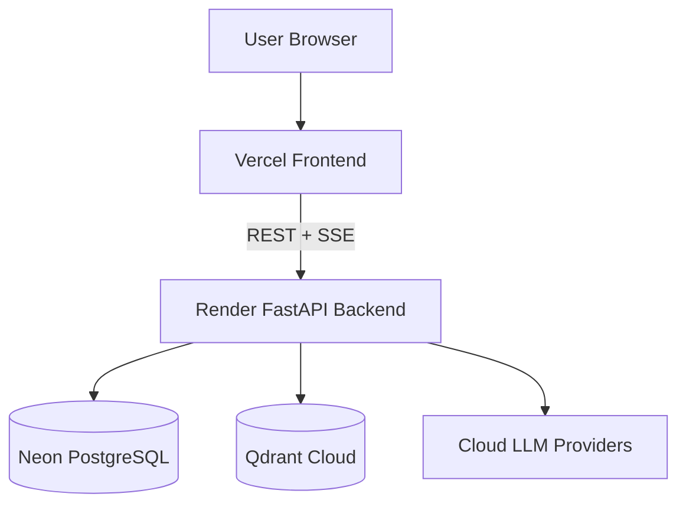

# Sovereign AI Workbench v2.0

**Production-ready AI workbench with agentic execution, multi-provider LLM routing, RAG, human-in-the-loop approvals, persistent agent timelines, and cloud/local deployment modes.**

[](https://sovereign-ai-workbench-2026.vercel.app/)
[](https://sovereign-ai-backend-ciy8.onrender.com)
[](https://github.com/saranshnimje/Sovereign-AI)

## Production deployment

| Component | Production | Purpose |
|---|---|---|
| Frontend | **Vercel** — https://sovereign-ai-workbench-2026.vercel.app/ | React/Vite application |
| Backend | **Render** — https://sovereign-ai-backend-ciy8.onrender.com | FastAPI REST/SSE API |
| Database | **Neon PostgreSQL** — project `Sovereign AI` | Application persistence |
| Vector DB | **Qdrant Cloud** | Production RAG vectors |
| LLMs | Configured cloud providers | Chat, reasoning, tool-calling and embeddings |

The canonical public frontend URL for this release is **https://sovereign-ai-workbench-2026.vercel.app/**.

## Architecture



Local development remains supported with Docker Compose, SQLite, local Qdrant and Ollama.

## Agent runtime

`UNDERSTAND → ROUTE → PLAN → REASON → EXECUTE → OBSERVE → VERIFY`

- Every agent execution has its own server-generated `run_id`.
- Agent Timeline is isolated by `run_id`; messages no longer share one combined timeline.
- Agent events are durably persisted to PostgreSQL.
- Unique `(run_id, sequence)` ordering is enforced in `agent_events`.
- Assistant messages are persisted before `final_response` so SSE interruptions do not silently lose responses.
- Success/error/cancel/fail/timeout paths enforce `final_response` before `done`.
- ASK_USER pause/resume returns a live SSE stream.
- Verification does not report success when verification output is unparseable.

## LLM routing and failover

- Greetings and simple requests are sent to the configured LLM; deterministic canned responses are not used as a production shortcut.
- Provider health tracking and failover are supported.
- OpenAI-compatible HTTP 429/5xx streaming failures are handled explicitly.
- If configured cloud providers are unavailable, production raises an explicit model-unavailable error instead of silently falling back to Ollama.
- Ollama remains supported for local/self-hosted development.

## RAG / knowledge base

- Document ingestion, chunking, embeddings and similarity search are supported.
- Production uses Qdrant Cloud; local development uses Docker Qdrant.
- Knowledge bases use isolated Qdrant collections.
- Retrieved sources can be surfaced as citations.

## Security

- JWT authentication and refresh-token rotation.
- Role-based access control for protected resources and tools.
- Central tool registry with risk/permission checks.
- Human approval for high/critical-risk operations.
- Docker sandboxing for untrusted code execution.
- SSRF and path-traversal protections.
- Pydantic validation at API/tool boundaries.
- Persistent audit logging.

## Production verification

Verified from the connected infrastructure on **2026-09-14**:

- **GitHub:** `main` is the default branch; the obsolete `fix/agent-timeline-llm-routing` branch is no longer present.
- **Render:** `sovereign-ai-backend` is not suspended, auto-deploys from `main`, and the latest deployment of commit `bb50d335af7bc851145c010663fdbf3168691d52` is **live**.
- **Neon:** production branch is **ready**; Alembic head is `d4e5f6a7b8c9`; `agent_events` has the required unique `(run_id, sequence)` index and FK to `agent_runs`.
- **Neon data:** production contains populated users, conversations, messages, agent runs/events and provider/model records.
- **Vercel:** the canonical frontend URL is confirmed as `https://sovereign-ai-workbench-2026.vercel.app/`; the connected Vercel account did not expose a project/team listing in this verification session, so Vercel runtime health was not independently queried through its API.
- **Qdrant Cloud:** production architecture points to Qdrant Cloud, but the connected tools did not expose Qdrant account health, so no unsupported live-health claim is made here.

## Test status

Latest repository verification:

- **787 backend tests passing**
- **Frontend TypeScript compilation clean**
- **Vite production build successful**
- Latest Render deployment live
- Neon schema head verified

Real production LLM/RAG smoke tests should be repeated after provider credentials, environment variables, or Qdrant configuration changes.

## Technology stack

- Frontend: React, TypeScript, Vite, Tailwind CSS, Zustand
- Backend: Python 3.11, FastAPI, Pydantic, Uvicorn
- Database: Neon PostgreSQL production; SQLite local
- Vector DB: Qdrant Cloud production; Qdrant Docker local
- LLM: configurable cloud/OpenAI-compatible providers; Ollama local
- Streaming: Server-Sent Events (SSE)
- Containers: Docker / Docker Compose
- Testing: pytest + pytest-asyncio and frontend type/build checks

## Development

```bash
git clone https://github.com/saranshnimje/Sovereign-AI.git
cd Sovereign-AI
docker compose up --build
```

Never commit secrets. Use environment variables for provider credentials, database URLs, Qdrant credentials and deployment configuration.

## Release

**v2.0 — 2026-09-14**

Release commit: `bb50d335af7bc851145c010663fdbf3168691d52`

This release includes critical agent runtime reliability fixes, real LLM routing for simple requests, provider failover/error handling, durable assistant-message persistence, lifecycle ordering, ASK_USER SSE resume, per-run Agent Timeline isolation, verification correctness, and the unique agent-event sequence constraint.
