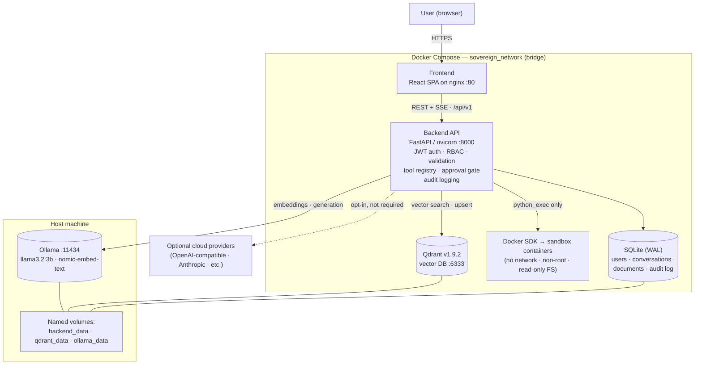

# Sovereign AI

**Secure, self-hosted AI workbench for private and sovereign AI workloads.**

Sovereign AI is a self-hosted AI workbench designed for organizations that need control over their own AI infrastructure and sensitive data. It combines local LLM inference (Ollama), a retrieval-augmented knowledge base backed by a local vector database, a permissioned tool/agent system with human-in-the-loop approvals, role-based access control, and a tamper-evident audit log — all deployable as a single Docker Compose stack on your own hardware. Documents, embeddings, conversations, and inference stay inside your network; external cloud AI providers can be connected optionally, but are never required for core functionality.


---

## 1. Overview

Sovereign AI is an on-premise AI platform that lets organizations use modern AI capabilities — chat, document understanding, knowledge-base question answering, and tool-using agents — without routing workloads through external cloud services by default.

It is designed for teams and institutions that handle sensitive or regulated information and want AI features under their own operational control.

Organizations adopt self-hosted AI because it keeps data locality, infrastructure ownership, and operational policy in their hands rather than depending on external services. Sovereign AI implements this pattern end-to-end: the models run locally via Ollama, documents and embeddings live in your own storage, and every AI action passes through authentication, authorization, validation, approval gates, and audit logging.

**The problem it solves:** how do you give users genuinely useful AI — grounded in *your* documents and able to perform *controlled* actions — while keeping the data, the models, and the decision authority inside your own infrastructure?

## 2. Problem Statement

Organizations handling sensitive workloads face structural limitations when they depend entirely on external cloud AI services:

| Constraint | Impact on sensitive workloads |
|---|---|
| **Data governance** | Prompts and documents leave the organization's perimeter; data-handling policy is delegated to an external provider's terms. |
| **Privacy** | Confidential material (contracts, internal records, personal data) transits third-party infrastructure. |
| **Vendor dependency** | Pricing, model availability, rate limits, and API changes are controlled externally and can change without notice. |
| **Internet dependency** | Cloud-only AI stops working when connectivity does — unacceptable for offline or constrained environments. |
| **Infrastructure control** | The organization cannot choose hardware, isolation boundaries, patch cadence, or deployment topology. |
| **Compliance requirements** | Regulatory regimes may require data locality, retention control, and demonstrable audit trails that hosted services cannot evidence. |
| **Operational control** | Logging, access control, and incident response must be reconstructed across organizational boundaries. |

These are architectural constraints, not criticisms of any specific provider — many cloud AI services are excellent products. The point is that some workloads require a deployment model where none of this is outsourced.

## 3. Our Solution

Sovereign AI implements the alternative deployment model:

```
User ──► Sovereign AI Workbench ──► Local / self-hosted AI infrastructure
                                          │
                                          ├── Ollama (local model inference)
                                          ├── Qdrant (local vector store)
                                          ├── SQLite (application data + audit log)
                                          └── Docker sandbox (isolated tool execution)
```

- **Where data stays:** uploaded documents, extracted text, chunk embeddings, chat history, user accounts, and the audit log all persist in volumes on the host machine (`backend_data`, `qdrant_data`, `ollama_data`). Core inference runs against local models served by Ollama.
- **When external connectivity is unavailable:** after the one-time setup downloads (Docker images and Ollama model weights), core functionality — login, chat, RAG queries over indexed documents, agent runs with local tools, approvals, and auditing — operates entirely on the local network. Internet connectivity is only required for initial setup and for *optional* cloud providers.
- **Optional escalation:** administrators can additionally register cloud/OpenAI-compatible providers (OpenAI, Anthropic, Gemini, OpenRouter, NVIDIA NIM, custom vLLM/LM Studio endpoints). These are opt-in per deployment; nothing requires them.

## 4. Key Features

Verified against the codebase:

- 💬 **Local AI chat** — streaming responses (Server-Sent Events) against Ollama-served models, with conversation persistence, export, and deletion
- 🧠 **Knowledge Base / RAG** — upload PDFs, DOCX, TXT, CSV and images; documents are validated, extracted (with OCR step), cleaned, chunked, embedded via `nomic-embed-text`, and indexed into per-KB Qdrant collections; answers include `[Source N]` citations
- 📄 **Document pipeline tracking** — each document reports per-step status/duration through seven pipeline stages
- 🤖 **AI agents** — goal-driven runs that plan, select tools, execute, and synthesize results, streamed live over SSE with full tool-call traces
- 🔧 **Permissioned tool system** — 12 built-in tools registered in a central registry with risk levels (low/medium/high/critical), minimum-role requirements, and Pydantic input schemas; the LLM can never execute anything directly
- ✅ **Human-in-the-loop approvals** — high/critical-risk tool calls (e.g., `file_delete`, `python_exec`) block until an admin explicitly approves; expired requests auto-*reject*
- 🐳 **Hardened Docker sandbox** — untrusted Python executes in throwaway containers with no network, non-root UID, read-only root filesystem, dropped capabilities, and CPU/memory/time limits
- 🔒 **Authentication & RBAC** — bcrypt-hashed passwords, JWT HS256 access tokens, rotating refresh tokens stored as SHA-256 hashes with revocation; three-tier role hierarchy enforced server-side on every endpoint
- 📋 **Tamper-evident audit log** — append-only, SHA-256 hash-chained event log with integrity verification endpoint and CSV export; logs client IP (via trusted-proxy header only) and user agent
- 🏢 **Multi-provider management** — admin-managed AI provider registry (local + optional cloud), API keys stored but never returned by any read endpoint, live model discovery, model-role assignment (chat/embedding/vision)
- 🗂️ **Organizations & data sources** — org-scoped data sources feed dedicated knowledge bases; per-org Qdrant collections provide structural retrieval isolation; source credentials are masked on every read
- ⚙️ **System dashboard** — service health, CPU/RAM/disk metrics (psutil), activity feed, first-run setup wizard
- 🐳 **One-command deployment** — production Docker Compose stack with health-checked dependency ordering, plus a hot-reload development override

## 5. Why Sovereign AI?

| Capability | Sovereign AI | Cloud-only AI |
|---|---|---|
| Infrastructure control | Full — you own the host, network, and deployment topology | Provider-controlled |
| Data locality | Documents, embeddings, chats, and logs remain on your storage | Data processed on provider infrastructure |
| Local inference | Yes — Ollama models run on your hardware | Not applicable |
| Internet dependency | None for core operation after one-time setup | Required for every request |
| Vendor dependency | None for core stack; optional providers are swappable | Inherent to the model |
| Custom deployment | Docker Compose on any machine meeting prerequisites | Provider-defined options only |
| Audit trail | Hash-chained log stored in your database, exportable | Provider-side, outside your control |
| Cost model | Hardware + electricity; no per-token billing | Per-token subscription/API pricing |

This table describes deployment-model trade-offs; it is not a claim that local models outperform frontier cloud models (see [Limitations](#28-limitations)).

## 6. Architecture



### Components

| Component | Role |
|---|---|
| **Frontend (React/nginx)** | Single-page app; talks only to the backend REST/SSE API; served by nginx which sets `X-Real-IP` for trustworthy client-IP logging |
| **Backend API (FastAPI)** | All business logic: authentication, RBAC, document pipeline, RAG orchestration, agent planning loop, tool registry gateway, approval workflow, audit chain |
| **Ollama** | Local model serving for chat and embedding models; discovered dynamically; seeded automatically at first startup |
| **Qdrant** | Vector database; one collection per knowledge base / organization for structural isolation |
| **SQLite (async, WAL)** | Application persistence: users, refresh tokens, conversations, documents, KBs, agent runs, approvals, hash-chained audit events |
| **Docker sandbox** | Execution environment for the `python_exec` tool; hardened profile detailed in [Security Architecture](#8-security-architecture) |

## 7. Technology Stack

| Layer | Technology | Purpose |
|---|---|---|
| Frontend | React 18.3, TypeScript 5.5, Vite 5.3, Tailwind CSS 3.4, Zustand 4.5, React Router 6.24, Axios | User interface |
| Backend | Python 3.11, FastAPI 0.111, Pydantic v2, Uvicorn, structlog | REST/SSE API and business logic |
| Database | SQLite (SQLAlchemy 2 async + aiosqlite, Alembic migrations) | Relational persistence |
| Vector store | Qdrant 1.9.2 (qdrant-client) | Embedding storage and similarity search |
| AI runtime | Ollama 0.3.12 | Local model inference (chat + embeddings) |
| Document processing | PyMuPDF, python-docx, pandas, custom magic-bytes validator; optional PaddleOCR | Extraction and ingestion |
| Sandboxing | Docker SDK for Python | Isolated execution of untrusted code |
| Authentication | PyJWT (HS256) + passlib/bcrypt (cost 12) | Identity and session security |
| Containerization | Docker + Docker Compose v2 | Deployment (prod + dev profiles) |
| Testing | pytest 8.2 + pytest-asyncio, ESLint, Bandit | Automated verification |

## 8. Security Architecture

Security mechanisms below are **implemented in code** — each cites its location:

### Identity & sessions
- Passwords hashed with **bcrypt cost 12**; common-password blocklist at registration (`services/auth_service.py`)
- **JWT HS256** access tokens (default TTL 60 min) carrying `sub` + `type`; verified on every request via `get_current_user`
- **Refresh-token rotation**: presented token is revoked on use and replaced; only SHA-256 hashes stored server-side; logout revokes; expiry enforced (`services/auth_service.py`)
- First registered account becomes `admin` (server-side count check); subsequent registrations default to `viewer`

### Authorization (RBAC)
- Ranked roles `viewer < analyst < admin` enforced via `require_role(...)` dependencies on **every** protected router (`dependencies.py`)
- Resource-level ownership checks: users see only their own conversations/agent runs; admins see all; foreign org/KB access returns 404 (`routers/data.py`, `routers/agents.py`)
- Tool invocation additionally gated by per-tool `required_role` inside the registry (`tools/registry.py`)

### Input handling & injection defense
- Every API payload and every tool call validated by **Pydantic schemas** before use
- RAG treats retrieved document text as **untrusted**: wrapped in delimiters, capped at 800 chars/chunk, injected under a system prompt that forbids following instructions found in context and mandates citations (`services/rag_service.py`)
- Web tools treat fetched/search content as data only and **block private/loopback targets (SSRF guard)** with response size caps (`tools/web.py`)
- Calculator rejects import/exec/eval constructs (`tools/calculator.py`)
- File tools enforce relative paths within the workspace (no directory traversal)

### Execution containment
- **The LLM never executes anything directly.** All proposals flow through `ToolRegistry.execute()` — the sole gateway performing name lookup, enablement check, role check, risk assessment, schema validation, then handler dispatch (`tools/registry.py`)
- Risk ≥ high ⇒ **human approval required**: run blocks in `awaiting_approval`; expired requests auto-*reject*; approved input must byte-match proposed input; decision recorded with actor, time, note (`services/approval_service.py`)
- Sandbox profile (non-negotiables in code): fresh container per run, UID 1000, `cap_drop ALL`, `network_mode=none`, read-only root FS, `pids_limit=50`, memory/CPU quotas, hard timeout, auto-remove, no Docker socket mounted, output caps (`services/sandbox_service.py`)

### Transport, headers, logging
- Security headers on every response: `X-Content-Type-Options`, `X-Frame-Options: DENY`, `X-XSS-Protection`, `Referrer-Policy` (`main.py`)
- Strict CORS allowlist (origins, methods, headers); request-ID middleware for traceability
- **Audit log**: append-only, SHA-256-chained entries (`prev_hash` → `entry_hash`), sequence-numbered, with `verify_chain()` recomputation endpoint and admin CSV export; client IP taken from nginx-set `X-Real-IP` or TCP peer — `X-Forwarded-For` deliberately ignored as spoofable (`services/audit_service.py`)
- Secrets come exclusively from environment; `.env` is git-ignored; provider API keys are stored server-side but **never included in GET responses** (asserted in tests)

### Network segmentation
- Single internal bridge network; only frontend/backend ports published; sandbox containers have no network at all

### Security design vs. security verification

**Design** is what the code enforces (above). **Verification** is what tests demonstrate. This repository includes both — unit/integration suites covering auth flows, RBAC denial paths, key-masking, and chain integrity (see [Testing & Verification](#22-testing--verification) and the results in [`docs/RELEASE_CHECKLIST.md`](docs/RELEASE_CHECKLIST.md)). Verification is point-in-time and scope-limited; it is not a guarantee against all attack classes. Known gaps (e.g., no rate limiting yet) are listed under Limitations.

## 9. Prompt Injection Protection

Prompt injection cannot be fully eliminated; the system applies layered defenses so injected instructions face multiple independent gates:

```
User Input
   ↓
Pydantic schema validation (types, lengths, enums)
   ↓
Instruction/content separation — RAG context wrapped in delimiters,
grounded system prompt ("answer ONLY from provided context", cite sources)
   ↓
Tool permission check — registry verifies role + enablement + risk
   ↓
Approval gate — human decision mandatory for high/critical tools;
approved payload must match proposal exactly
   ↓
Model execution — local Ollama inference
   ↓
Controlled output — tool effects limited to sandbox/workspace;
every action appended to tamper-evident audit chain
```

Additional layers: untrusted web content is data-not-instructions, private-network fetches blocked, calculator keyword rejection, directory-traversal protection, and container isolation for code execution.

## 10. Offline / Air-Gapped Deployment

Three operating modes, matching the implementation:

| Mode | Support | Details |
|---|---|---|
| **Fully offline operation** | ✅ Supported | After one-time downloads (Docker images + Ollama weights ≈ 2.5 GB min), all core functionality — auth, chat, RAG, agents with local tools, approvals, audit — runs without internet. `docs/HARDWARE_CHECKLIST.md`: *"Internet: Only for initial setup. Fully offline after model pull."* |
| **Normal connected deployment** | ✅ Default | Same stack behind your firewall; nothing phones home during operation. |
| **Optional external providers** | ⚙️ Opt-in | Admins may add OpenAI/Anthropic/Gemini/OpenRouter/NVIDIA/custom endpoints; those specific requests then transit the internet by definition. Never required. |

An internet-connected installation is therefore **air-gap-capable**: pull images/models once on a connected machine, transfer, and operate disconnected. True zero-touch air-gapped provisioning (offline registries/mirrors) is future scope.

**Ollama's role:** it is the default, seeded-at-startup provider (`PROVIDER_OLLAMA`, environment `local`). Chat uses a configurable model (default `llama3.2:3b`); RAG embeddings use `nomic-embed-text`. Both run as ordinary processes on your host or in the compose service.

## 11. AI Model Strategy

Local/self-hosted models are the default because they keep inference — and everything sent to the model — on your hardware:

- **Ownership/control** — model weights live in your `ollama_data` volume; you choose versions and pin them; no external party can deprecate them mid-operation
- **Local inference** — generation and embeddings both execute via Ollama on your CPU/GPU
- **Data locality** — prompts containing your documents never need to leave the machine
- **Model selection** — any Ollama-pullable model works; admins assign roles (chat / embedding / vision) and register additional providers with live discovery
- **Resource requirements** — reference configuration: `llama3.2:3b` (~2 GB disk, ~3 GB RAM) + `nomic-embed-text` (~0.5 GB); larger models like `mistral:7b-q4` or `qwen3:14b` improve quality and raise RAM/latency accordingly
- **Honest trade-offs** — local models generally trail frontier cloud models on reasoning breadth and speed-per-dollar on small hardware; CPU inference is slow for large models (documented latencies in `docs/HARDWARE_CHECKLIST.md`). Where quality demands outweigh locality, admins can attach a cloud provider explicitly — the architecture makes that a deliberate, auditable choice rather than a silent default.

## 12. Knowledge Base / RAG

Implemented pipeline (step names exactly as tracked in `services/document_service.py`):

```
Document (PDF · DOCX · TXT · CSV · image)
   ↓  Upload (multipart, size/MIME magic-byte validation)
   ↓  Validation
   ↓  Extraction (PyMuPDF / python-docx / text)
   ↓  OCR  (optional step for scanned pages; graceful skip if engine absent)
   ↓  Cleaning (whitespace/boilerplate normalization)
   ↓  Chunking (token-aware, overlapping)
   ↓  Embedding (nomic-embed-text via Ollama /api/embed, batched)
   ↓  Indexing (upsert into per-KB Qdrant collection)
   ↓  Done — status + per-step timings visible in UI/API
```

Query path (`services/rag_service.py`): embed query → Qdrant similarity search (top-k, score threshold) → context assembly under a token budget → grounded generation → **answer + cited sources** (`filename`, page, score, `[Source N]` markers) with a low-confidence flag when retrieval is weak.

## 13. Role-Based Access Control

Roles verified in `schemas/auth.py` and `tools/registry.py` (ranked hierarchy):

| Capability | Viewer | Analyst | Admin |
|---|:-:|:-:|:-:|
| Log in, view dashboard, list models/tools | ✅ | ✅ | ✅ |
| Use safe utilities (calculator, time, tool discovery, model select) | ✅ | ✅ | ✅ |
| Create conversations / chat | ✅ | ✅ | ✅ |
| Create knowledge bases, upload documents, run agents | ❌ | ✅ | ✅ |
| Analyst-gated tools (file ops, `search_kb`, `web_search/fetch`) | ❌ | ✅ | ✅ |
| High-risk tool execution (`file_delete`, `python_exec`) | ❌ | ✅ + admin approval | ✅ + approval |
| User management, settings, providers, plugins, tool config | ❌ | ❌ | ✅ |
| Audit log access, chain verification, CSV export | ❌ | ❌ | ✅ |
| Approval decisions (approve/reject) | ❌ | ❌ | ✅ |
| See other users' resources | ❌ | ❌ | ✅ |

**Isolation:** conversations, agent runs, uploads, and organizations are scoped to their owner in SQL queries (not just hidden in UI); knowledge bases map to dedicated Qdrant collections so retrieval is structurally partitioned; admins bypass scoping intentionally for administration.

Enforcement is server-side on every route via FastAPI dependencies — the frontend hiding buttons is convenience, never the security boundary.

## 14. Provider / Model Management

Admin-only endpoints under `/api/v1/models/providers` (`routers/providers.py`, `services/provider_service.py`):

- **Create** connections for 8 supported types: `ollama` (default, auto-seeded at startup), `openai`, `anthropic`, `gemini`, `openai_compatible` (vLLM/LM Studio/LocalAI/gateways), plus presets for `openrouter`, `opencode_zen`, `nvidia`
- **Configure** base URL, API key, default model; presets ship sensible defaults and require API keys only where the upstream demands them
- **Enable/disable** and **delete** connections (deletion cascades cleanly; default Ollama seed is idempotent)
- **Live model discovery** — model lists are always fetched from the provider, never hardcoded
- **Access restrictions** — all management routes require `admin`; regular users consume whatever connection their feature resolves to; **API keys are write-only from the API's perspective** (masked/excluded in every read; asserted by tests)
- **Health checks & auth verification** per connection; model-role assignment (chat/embedding/vision) with pull-streaming for Ollama models

## 15. Tools / Plugins

Architecture (`tools/registry.py`): every capability is a `ToolDefinition` registered centrally with description, typed input/output schemas, **risk level**, **minimum role**, permission tags, and a handler. Agent planning proposes tools; the registry alone decides what actually runs.

Built-in tools (12):

| Tool | Category | Risk | Min role |
|---|---|---|---|
| `file_read`, `file_list` | files | low | analyst |
| `file_write` | files | medium | analyst |
| `file_delete` | files | **high** → approval | analyst |
| `search_kb` | knowledge | low | analyst |
| `calculator`, `time_now` | utilities | low | viewer |
| `web_search`, `web_fetch` | web | medium | analyst |
| `tool_discovery`, `model_select` | agent | low | viewer |
| `python_exec` | advanced | **high** → approval, sandboxed | analyst |

Controls implemented:
- **Registration** is code-defined (single place to audit); duplicate names rejected
- **Enable/disable** per tool via admin endpoints (`routers/tools.py`); disabled tools vanish from listings *and* execution lookups
- **Permissions** surfaced as explicit identifiers (e.g., `workspace_filesystem_write`, `sandboxed_code_execution`, `internet_access`) shown in API/UI
- **Execution** always follows the enforced sequence in `services/agent_service.py`: registry lookup → `check_permission` (role) → `validate_input` (Pydantic) → `requires_approval` (risk) → approval gate if ≥high → handler via `execute()` with **validated input only** (sandboxed through `SandboxService` when `requires_sandbox`) → audit entry
- Plugins are **code-defined manifests bundling registered tools**: disabling a plugin disables every tool it provides, no plugin code is ever executed, and admin enable/disable/test endpoints are audit-logged (`routers/plugins.py`)

## 16. Project Structure

```text
Sovereign-AI/
├── frontend/                  # React 18 + TypeScript SPA
│   ├── src/
│   │   ├── api/               # typed API clients (axios)
│   │   ├── components/        # layout shell, UI primitives
│   │   ├── pages/             # Login, Dashboard, Chat, Agents, Approvals,
│   │   │                      # Audit, Data, KnowledgeBases(+Detail),
│   │   │                      # Models, Providers, Plugins, Settings, Tools
│   │   ├── stores/            # Zustand stores (auth, ui)
│   │   └── utils/
│   ├── Dockerfile             # multi-stage: node build → nginx serve
│   ├── nginx.conf             # SPA routing + X-Real-IP proxy
│   └── package.json
├── backend/                   # FastAPI application
│   ├── models/                # SQLAlchemy ORM (user, agent, audit, data,
│   │                          # conversation, knowledge_base, provider, …)
│   ├── routers/               # 14 route modules under /api/v1
│   ├── schemas/               # Pydantic v2 request/response models
│   ├── services/              # business logic (auth, chat, rag, qdrant,
│   │                          # document, agent, approval, audit, sandbox, …)
│   ├── tools/                 # 12 built-in tools + central registry
│   ├── utils/                 # chunker, file validator, text cleaner
│   ├── tests/
│   │   ├── unit/              # 61 tests
│   │   └── integration/       # 157 tests
│   ├── Dockerfile             # python:3.11-slim, non-root runtime user
│   ├── config.py              # env-driven settings (pydantic-settings)
│   ├── main.py                # app factory, middleware, router wiring
│   └── requirements.txt       # pinned dependencies
├── docs/                      # 19 project documents (+ PDF guide)
├── scripts/                   # setup.sh, backup.sh, pull_models.sh,
│                              # validate_stack.py, rag_validation.py, …
├── docker-compose.yml         # production stack (frontend+backend+qdrant+ollama)
├── docker-compose.dev.yml     # dev overlay: hot reload, Vite :5173
├── .env.example               # documented template (safe placeholders)
└── .gitignore                 # excludes .env, node_modules, dist, caches, data
```

## 17. Prerequisites

Per `docs/HARDWARE_CHECKLIST.md` and the compose/Dockerfiles:

**Software**
- Git
- **Docker 24+** with **Docker Compose v2** (`docker compose version`)
- **Ollama** (latest stable) installed on the host
- *(Only for non-Docker development)* Python 3.11 and Node.js 20

**Hardware**

| Resource | Minimum | Recommended |
|---|---|---|
| RAM | 8 GB | 16 GB |
| CPU | 4 cores | 8 cores, 3 GHz+ |
| Disk free | 20 GB | 50 GB (SSD) |
| GPU | Not required (CPU inference works) | Optional NVIDIA 6 GB+ VRAM (auto-detected by Ollama) |
| OS | Windows 10+, macOS 12+, Ubuntu 20.04+ | — |

## 18. Installation

```bash
git clone https://github.com/saranshnimje/Sovereign-AI.git
cd Sovereign-AI
```

Pull the two required models (one-time, ~2.5 GB, internet needed):

```bash
ollama pull llama3.2:3b          # chat
ollama pull nomic-embed-text     # embeddings (required for RAG)
```

Run the first-time setup script, which checks Docker/Ollama, generates `.env` with a random `SECRET_KEY`, pre-pulls the `python:3.11-slim` sandbox image, and verifies/pulls models:

```bash
bash scripts/setup.sh
```

Then start the stack (next section) and open **http://localhost** — the first-run wizard creates the initial **admin** account (first registered user receives the admin role server-side).

Other utility scripts: `scripts/backup.sh` (volume backup), `scripts/pull_models.sh` (model sync).

## 19. Environment Configuration

Copy `.env.example` to `.env` — or let `setup.sh` generate it. **Never commit `.env`** (gitignored) and use your own generated secret:

```env
# ---- REQUIRED ----
SECRET_KEY=change-this-to-32-plus-random-characters   # e.g. python -c "import secrets; print(secrets.token_hex(32))"

# ---- OPTIONAL (defaults shown) ----
OLLAMA_URL=http://host.docker.internal:11434   # Linux: http://172.17.0.1:11434
QDRANT_URL=http://qdrant:6333
FRONTEND_ORIGIN=http://localhost
MAX_UPLOAD_SIZE_MB=50
SANDBOX_IMAGE=python:3.11-slim
SANDBOX_TIMEOUT_S=30
SANDBOX_MEM_LIMIT_MB=256
LOG_LEVEL=INFO
AUDIT_RETENTION_DAYS=365
JWT_ACCESS_TTL_MIN=60
JWT_REFRESH_TTL_DAYS=7
DEFAULT_CHAT_MODEL=llama3.2:3b
DEFAULT_EMBEDDING_MODEL=nomic-embed-text
DATA_DIR=/app/data                             # local dev w/o Docker: ./data
```

The values above are placeholders copied from `.env.example` — no real credentials exist in this repository.

## 20. Running with Docker

**Production:**

```bash
docker compose up --build -d
# wait ~60 s for healthchecks, then:
curl http://localhost/api/v1/system/health      # {"status":"ok"}
docker compose ps                               # all services healthy
```

Services & ports: frontend `:80` · backend `:8000` · Qdrant `:6333/:6334` · Ollama `:11434`.

**Development (hot reload — Vite on :5173, uvicorn --reload):**

```bash
docker compose -f docker-compose.yml -f docker-compose.dev.yml up --build
```

**Lifecycle:** `docker compose down` (keeps data) · `docker compose down -v` (⚠ wipes volumes) · Swagger UI at `http://localhost:8000/api/docs`.

## 21. Running Without Docker

Supported for development (per `.env.example` guidance and package scripts):

**Backend** (Python 3.11):

```bash
cd backend
pip install -r requirements.txt
# point DATA_DIR at a writable folder and provide required vars, e.g.:
#   DATA_DIR=./data SECRET_KEY=<your-generated-key> OLLAMA_URL=http://localhost:11434
uvicorn main:app --reload          # http://localhost:8000/api/docs
```

> Note: the `python_exec` sandbox tool requires a reachable Docker daemon even in this mode (it degrades gracefully with a clear warning otherwise).

**Frontend** (Node.js 20):

```bash
cd frontend
npm install
npm run dev                        # http://localhost:5173
npm run build                      # type-checks (tsc) + production bundle
```

## 22. Testing & Verification

Automated suites shipped in-repo (`backend/tests/`, pytest asyncio auto-mode):

| Suite | Contents |
|---|---|
| Unit (61 tests) | auth service, approval service, chunker, config/data-dir, embedding, file validator, audit hash chain, qdrant service, RAG, sandbox profile, tool registry permissions, tools |
| Integration (157 tests) | auth API, agents API, KB API, providers API, provider discovery (incl. key-masking & SSRF cases), tools/plugins API, Phase 4–5 API (settings, SSE, RBAC denials) |

Recorded verification results from [`docs/RELEASE_CHECKLIST.md`](docs/RELEASE_CHECKLIST.md) (v1.0 RC, 2026-08-24):

| Check | Result |
|---|---|
| Backend tests (61 unit + 157 integration = 218) | ✅ PASS — 218/218 |
| TypeScript compilation | ✅ PASS — zero errors |
| Frontend production build | ✅ PASS |
| ESLint | ✅ Configured/passing |
| Bandit static analysis | ✅ 0 medium/high (10 low, all reviewed-intentional B110) |
| `docker compose config` | ✅ exits 0 |
| Live end-to-end validation (`scripts/validate_stack.py`) | ✅ 74/74 checks |
| Docker runtime healthchecks (qdrant → backend → frontend order) | ✅ Verified live |

Reproduce locally:

```bash
cd backend && pytest tests/ -v          # automated suites
python scripts/validate_stack.py        # 74-check live validation (stack running)
python scripts/rag_validation.py        # end-to-end RAG validation
```

Additional QA assets: `docs/DEMO_GUIDE.md` (scripted demo), `docs/HARDWARE_CHECKLIST.md` (pre-demo verification script), `docs/RELEASE_CHECKLIST.md` (full release evidence incl. known issues).

No frontend unit-test runner is configured (ESLint + `tsc` cover the frontend statically) — stated plainly rather than implied otherwise.

## 23. Security Verification

Results actually recorded in [`docs/RELEASE_CHECKLIST.md`](docs/RELEASE_CHECKLIST.md):

| Area | Result |
|---|---|
| First-user-becomes-admin enforcement | ✅ PASS (server-side) |
| Login/JWT issue + `/me` | ✅ PASS |
| RBAC: viewer denied audit / settings / KB-create / agent-run / model-roles | ✅ PASS — 403 on each |
| Password hash never exposed (`/me`, `/users`) | ✅ PASS |
| Provider `api_key` never present in list/detail responses | ✅ PASS (dedicated test suite) |
| Knowledge-base create/query lifecycle | ✅ PASS |
| Audit hash-chain integrity (`verify_chain`) | ✅ PASS — chain verified live |
| Approvals pending-list/count endpoints (admin-gated) | ✅ PASS |
| Tools list & agent run trace (incl. SSE `text/event-stream`) | ✅ PASS |
| Bandit static analysis | ✅ 0 medium/high findings |

These are point-in-time prototype results, reproduced by running the commands above — not ongoing certifications.

## 24. Documentation

Full documentation ships in [`docs/`](docs/) — 19 files:

**Product & Requirements**
- [01 PRD — Product Requirements](docs/01_PRD_Product_Requirements.md) · [02 TRD — Technical Requirements](docs/02_TRD_Technical_Requirements.md) · [13 Requirements Traceability](docs/13_Requirements_Traceability.md)

**Architecture & Design**
- [03 System Architecture](docs/03_System_Architecture.md) · [07 AI/ML Design](docs/07_AI_ML_Design.md) · [06 Backend/Database/API](docs/06_Backend_Database_API.md) · [05 UI/UX Specification](docs/05_UI_UX_Specification.md) · [04 App/User Flow](docs/04_App_User_Flow.md)

**Security**
- [08 Security & Privacy](docs/08_Security_Privacy.md) (threat model & controls)

**Delivery, Deployment & Operations**
- [09 Implementation Plan](docs/09_Implementation_Plan.md) · [11 Deployment & DevOps](docs/11_Deployment_DevOps.md) · [12 Risk & Mitigation](docs/12_Risk_Mitigation.md) · [HARDWARE_CHECKLIST](docs/HARDWARE_CHECKLIST.md) · [RELEASE_CHECKLIST](docs/RELEASE_CHECKLIST.md)

**Quality, Usage & Demo**
- [10 Testing & QA Plan](docs/10_Testing_QA_Plan.md) · [14 User Guide](docs/14_User_Guide.md) · [DEMO_GUIDE](docs/DEMO_GUIDE.md) · [15 Project README](docs/15_Project_README.md)

**Complete Guide (PDF)**
- [Sovereign_AI_Workbench_Complete_Project_Guide.pdf](docs/Sovereign_AI_Workbench_Complete_Project_Guide.pdf)

## 25. Screenshots / Demo

> **Placeholder — screenshots are not yet committed to this repository.** Suggested captures once added: first-run setup wizard, dashboard with live service metrics, streaming chat with a local model, RAG answer with `[Source N]` citations, agent run trace with approval gate, audit-chain verification result.

Until then, [`docs/DEMO_GUIDE.md`](docs/DEMO_GUIDE.md) provides a scripted 5-minute walkthrough and talking points, and `scripts/_live_audit.py` produces an on-screen technical audit suitable for live evaluation.

## 26. Deployment Scenarios

Potential use cases enabled by the architecture (deployment models, not claims of existing production installs):

- **Enterprise private infrastructure** — internal knowledge assistants over contracts/policies without external processing
- **Government / public-sector environments** — data-locality-oriented deployments where custody and audit trails matter
- **Research institutions** — corpus-grounded Q&A over unpublished papers and datasets
- **Sensitive internal knowledge systems** — HR/legal/finance helpdesks grounded in confidential documents
- **Offline / connectivity-constrained sites** — field or secured facilities operating after one-time provisioning

Suitability always depends on the organization's own compliance assessment.

## 27. Advantages

- **Data control** — documents, embeddings, chats, and logs remain on storage you own
- **Infrastructure ownership** — commodity hardware, your network, your patch cadence
- **Local inference** — core AI works without internet after setup
- **Custom deployment** — single-compose-portable; swap models/providers per deployment
- **Extensible architecture** — add tools via registry definitions, providers via one adapter mapping, roles/permissions centrally enforced
- **Verifiability** — 218 automated tests, live validation script, and a hash-chained audit trail you can independently recompute

## 28. Limitations

Stated plainly:

- **Hardware-bound performance** — CPU inference is slow for larger models (e.g., ~90–230 s/response observed for `qwen3:14b` on CPU); meaningful quality tiers require significant RAM/VRAM
- **Model quality varies** — local open-weight models trail frontier cloud models on complex reasoning; RAG answers are bounded by retrieval and model capability
- **Single-node prototype** — SQLite + single-host Compose target ≤ ~10 concurrent users (per `docs/03_System_Architecture.md`); PostgreSQL/Kubernetes are future scope
- **Initial deployment complexity** — Docker + Ollama + model pulls are one-time hurdles; misconfigured `SECRET_KEY`/URLs are common first-run failures
- **Optional features need connectivity** — cloud providers, `web_search`/`web_fetch` tools, and initial downloads inherently use the internet
- **No rate limiting / WAF yet** — request throttling is not implemented in the current prototype
- **OCR is optional-heavy** — the PaddleOCR engine is commented out of `requirements.txt` (≈2 GB install); scanned-document support requires enabling it explicitly
- **Point-in-time verification** — recorded test/security results reflect the v1.0 RC snapshot, not continuous assurance

## 29. Future Scope

*(Planned directions — not current features.)* PostgreSQL migration behind the existing `DATABASE_URL` seam · Kubernetes/Helm packaging · LDAP/SSO enterprise identity · request rate limiting and WAF integration · multi-agent orchestration · fine-tuning pipeline for domain models · federated knowledge bases · plugin marketplace for third-party tools · enhanced observability (metrics/tracing exports) · expanded model-evaluation framework.

## 30. Team

| Member | Role |
|---|---|
| [@saranshnimje](https://github.com/saranshnimje) | Repository maintainer |

*(Team roster to be finalized here — names/roles are intentionally omitted from documentation pending confirmation.)*

## 31. SIH 2026

Project classified throughout its documentation as **“Internal — SIH 2026 Prototype.”**

- **Program:** Smart India Hackathon 2026
- **Problem statement ID/title:** not specified in the project documentation — to be added once officially assigned
- **Deliverable:** Sovereign AI Workbench v1.0 release candidate (code, tests, and 19-document engineering dossier in [`docs/`](docs/))

## 32. License

No `LICENSE` file currently exists in this repository. Project documentation marks the codebase *"Internal — SIH 2026 Prototype. All rights reserved by the developing team."*

**A license needs to be selected separately** before external reuse is permitted — until then, all rights are reserved by default and no open-source license is claimed.

---

<p align="center"><sub>Sovereign AI Workbench — privacy-first AI for organizations that need control.</sub></p>
