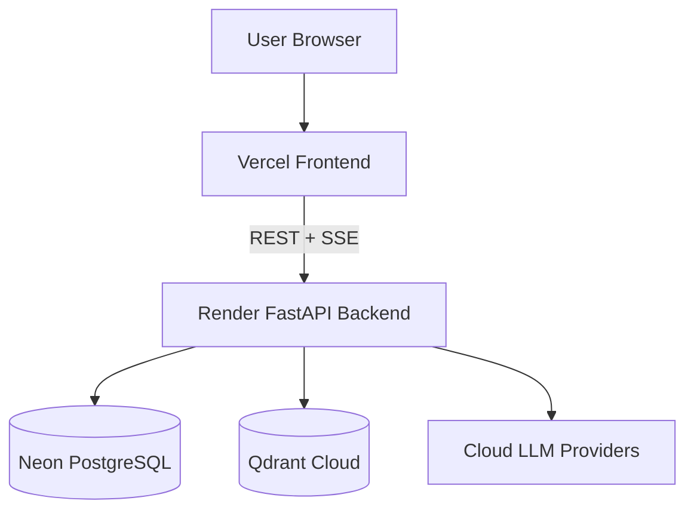

# Sovereign AI Workbench v2.0

**Production-ready AI workbench with agentic execution, multi-provider LLM routing, RAG, human-in-the-loop approvals, persistent per-run agent timelines, and cloud/local deployment modes.**

[](https://sovereign-ai-workbench-2026.vercel.app/)
[](https://sovereign-ai-backend-ciy8.onrender.com)
[](https://github.com/saranshnimje/Sovereign-AI)

## Production deployment

| Component | Production | Purpose |
|---|---|---|
| Frontend | **Vercel** — https://sovereign-ai-workbench-2026.vercel.app/ | React/Vite application |
| Backend | **Render** — https://sovereign-ai-backend-ciy8.onrender.com | FastAPI REST/SSE API |
| Database | **Neon PostgreSQL** — project `Sovereign AI` | Application persistence |
| Vector DB | **Qdrant Cloud** | Production RAG vectors |
| LLMs | Configured cloud providers | Chat, reasoning, tool-calling and embeddings |

The canonical public frontend URL for this release is **https://sovereign-ai-workbench-2026.vercel.app/**.

## Architecture



### Local architecture

Docker mode provides the complete local application stack. Non-Docker mode runs the frontend and backend directly on the host while using host-configured services.

```text
Docker mode:
Browser -> Frontend container -> Backend container -> SQLite/PostgreSQL
                                             -> Qdrant container
                                             -> Ollama or configured cloud LLM
                                             -> Docker sandbox

Non-Docker mode:
Browser -> Vite frontend -> FastAPI backend -> SQLite/PostgreSQL
                                          -> Qdrant
                                          -> Ollama or configured cloud LLM
```

## Agent runtime

`UNDERSTAND → ROUTE → PLAN → REASON → EXECUTE → OBSERVE → VERIFY`

- Every agent execution has its own server-generated `run_id`.
- Every user message in a conversation has its own Agent Timeline.
- Agent Timeline events are isolated by `run_id`; different messages never share one combined timeline.
- Agent events are durably persisted to PostgreSQL.
- Unique `(run_id, sequence)` ordering is enforced in `agent_events`.
- Assistant messages are persisted once before `final_response`, preventing duplicate responses and reducing SSE-loss risk.
- Success/error/cancel/fail/timeout paths enforce `final_response` before `done`.
- ASK_USER pause/resume returns a live SSE stream.
- Verification does not report success when verification output is unparseable.

## LLM routing and failover

- Greetings and simple requests are sent to the configured LLM; deterministic canned responses are not used as a production shortcut.
- Provider health tracking and failover are supported.
- OpenAI-compatible HTTP 429/5xx streaming failures are handled explicitly.
- If configured cloud providers are unavailable, production raises an explicit model-unavailable error instead of silently falling back to Ollama.
- Ollama remains supported for local/self-hosted development.

## RAG / knowledge base

- Document ingestion, chunking, embeddings and similarity search are supported.
- Production uses Qdrant Cloud; local development can use Docker Qdrant.
- Knowledge bases use isolated Qdrant collections.
- Retrieved sources can be surfaced as citations.

## Security

- JWT authentication and refresh-token rotation.
- Role-based access control for protected resources and tools.
- Central tool registry with risk/permission checks.
- Human approval for high/critical-risk operations.
- Docker sandboxing for untrusted code execution.
- SSRF and path-traversal protections.
- Pydantic validation at API/tool boundaries.
- Persistent audit logging.

## Download / installation

You can get the project either by cloning the Git repository or by downloading a ZIP archive from GitHub.

### Option A — Clone with Git

```bash
git clone https://github.com/saranshnimje/Sovereign-AI.git
cd Sovereign-AI
```

### Option B — Download ZIP

1. Open the GitHub repository: https://github.com/saranshnimje/Sovereign-AI
2. Click **Code**.
3. Select **Download ZIP**.
4. Extract the archive.
5. Open a terminal in the extracted `Sovereign-AI` directory.

Both methods contain the same application source. ZIP download is convenient when Git is not installed; Git clone is recommended for development and receiving future updates.

## Docker installation and run

### Prerequisites

- Docker Desktop 24+ on Windows/macOS, or Docker Engine + Docker Compose v2 on Linux
- Git (recommended) or the ZIP download above
- At least 8 GB RAM; 16 GB recommended for local LLM workloads
- At least 20 GB free disk space, plus model storage if using Ollama

### 1. Download the project

Use either the Git clone or ZIP method above.

### 2. Configure environment

```bash
cp .env.example .env
```

On Windows PowerShell:

```powershell
Copy-Item .env.example .env
```

Set a strong `SECRET_KEY` and configure any provider/database/Qdrant variables required for your deployment. Never commit `.env` or provider credentials.

### 3. Start the complete stack

```bash
docker compose up --build -d
```

For development with hot reload:

```bash
docker compose -f docker-compose.yml -f docker-compose.dev.yml up --build
```

### 4. Check health

```bash
curl http://localhost/api/v1/system/health
```

Expected result:

```json
{"status":"ok"}
```

### 5. Open the application

Open **http://localhost** in your browser.

### Stop the Docker stack

```bash
docker compose down
```

Use `docker compose down -v` only when you intentionally want to remove Docker-managed volumes and their stored data.

## Non-Docker installation and run

Non-Docker mode is useful for development, debugging, and environments where Docker is unavailable. The backend and frontend run directly on the host.

### Prerequisites

- Python 3.11+
- Node.js 18+ (Node 20 LTS recommended)
- npm
- Git or the ZIP download
- Qdrant, either a local Qdrant service or Qdrant Cloud
- Ollama only if you want local/self-hosted LLM inference

### 1. Download the project

```bash
git clone https://github.com/saranshnimje/Sovereign-AI.git
cd Sovereign-AI
```

Or download and extract the GitHub ZIP as described above.

### 2. Backend setup

Create and activate a Python virtual environment:

Windows PowerShell:

```powershell
cd backend
py -3.11 -m venv .venv
.\.venv\Scripts\Activate.ps1
python -m pip install --upgrade pip
pip install -r requirements.txt
```

Linux/macOS:

```bash
cd backend
python3.11 -m venv .venv
source .venv/bin/activate
python -m pip install --upgrade pip
pip install -r requirements.txt
```

Configure the environment variables before starting the backend. At minimum, set a strong `SECRET_KEY`. Use `DATABASE_URL` for PostgreSQL when desired; the local development configuration can use SQLite. Configure `QDRANT_URL`/`QDRANT_API_KEY` for Qdrant Cloud or a local Qdrant endpoint.

Start the backend from the `backend` directory:

```bash
uvicorn main:app --reload --host 0.0.0.0 --port 8000
```

The backend health endpoint is:

```text
http://localhost:8000/api/v1/system/health
```

### 3. Frontend setup

Open a second terminal:

```bash
cd frontend
npm install
npm run dev
```

Vite normally serves the frontend at:

```text
http://localhost:5173
```

Set the frontend API environment variable expected by the project so it points to your local backend, for example:

```text
VITE_API_URL=http://localhost:8000
```

Then open the Vite URL in your browser.

### 4. Build the frontend for production

```bash
cd frontend
npm run build
npm run preview
```

### 5. Run backend tests

```bash
cd backend
pytest tests/ -v
```

## Local LLM with Ollama

Ollama is optional for local/self-hosted development. It is **not** a silent production fallback.

Install Ollama from https://ollama.com/ and start it, then pull the models you want, for example:

```bash
ollama pull llama3.2:3b
ollama pull nomic-embed-text
```

Configure the local Ollama endpoint through the environment configuration. When using Docker, the default host-access pattern is typically `http://host.docker.internal:11434` on Docker Desktop.

For production, configure cloud providers instead of relying on local Ollama.

## Environment variables

Copy `.env.example` to `.env` and configure the values appropriate for your environment. Common variables include:

| Variable | Purpose |
|---|---|
| `SECRET_KEY` | JWT signing secret; use a strong random value |
| `DATABASE_URL` | PostgreSQL/SQLite application database connection |
| `QDRANT_URL` | Qdrant endpoint; Qdrant Cloud in production |
| `QDRANT_API_KEY` | Qdrant Cloud API key when required |
| `OLLAMA_URL` | Local Ollama endpoint for self-hosted development |
| `VITE_API_URL` | Frontend API base URL for non-Docker development |
| `MAX_UPLOAD_SIZE_MB` | Maximum upload size |
| `LOG_LEVEL` | Application logging level |

See `.env.example` for the full environment configuration. Never commit credentials or tokens.

## Production verification

Latest repository/deployment verification was performed against the connected infrastructure on **2026-09-14**. The latest application fix is commit **`fc1a854`** on `main`.

- **GitHub:** `main` contains the latest duplicate-response and per-message timeline fix; the obsolete `fix/agent-timeline-llm-routing` branch is absent.
- **Vercel:** the frontend deployment status for the latest GitHub flow is successful; canonical URL is `https://sovereign-ai-workbench-2026.vercel.app/`.
- **Render:** backend deployment for the latest fix is live and production health is available.
- **Neon:** production PostgreSQL is ready and contains the application schema including agent runs/events and messages.
- **Qdrant Cloud:** production configuration uses Qdrant Cloud rather than the local Docker Qdrant service.
- **LLM providers:** production routing uses configured cloud providers with failover; production does not silently fall back to Ollama.

Historical duplicate assistant-message rows may exist from pre-`fc1a854` data. The current code prevents new duplicate persistence; old records are not automatically deleted.

## Test status

Latest repository verification:

- **787 backend tests passing**
- **Frontend TypeScript compilation clean**
- **Vite production build successful**
- Latest production backend deployment live
- Neon production schema verified

Repeat a live authenticated chat/RAG smoke test after changing provider credentials, deployment environment variables, database configuration, or Qdrant configuration.

## Technology stack

- Frontend: React, TypeScript, Vite, Tailwind CSS, Zustand
- Backend: Python 3.11, FastAPI, Pydantic, Uvicorn
- Database: Neon PostgreSQL production; SQLite local
- Vector DB: Qdrant Cloud production; Qdrant Docker/local service for development
- LLM: configurable cloud/OpenAI-compatible providers; Ollama local
- Streaming: Server-Sent Events (SSE)
- Containers: Docker / Docker Compose
- Testing: pytest + pytest-asyncio and frontend type/build checks

## Development

```bash
# Backend tests
cd backend
pytest tests/ -v

# Frontend checks
cd ../frontend
npm run build
npm run lint
```

Never commit secrets. Use environment variables for provider credentials, database URLs, Qdrant credentials and deployment configuration.

## Documentation

Detailed documentation is available under `docs/`, including architecture, security, deployment, testing, and user guidance.

## Release

**v2.0 — 2026-09-14**

Latest fix commit: `fc1a854`

This release line includes critical agent runtime reliability fixes, real LLM routing for simple requests, provider failover/error handling, durable assistant-message persistence without duplicate inserts, lifecycle ordering, ASK_USER SSE resume, per-message Agent Timeline isolation, verification correctness, and the unique agent-event sequence constraint.
